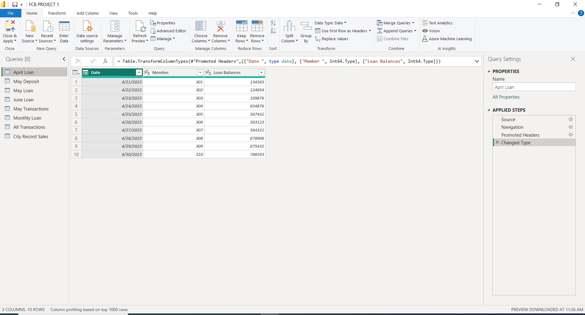
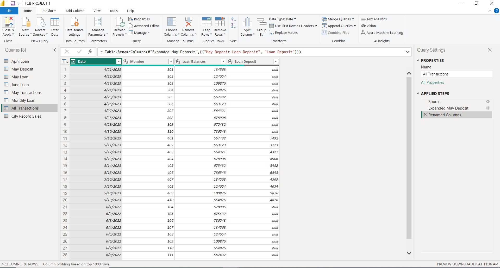
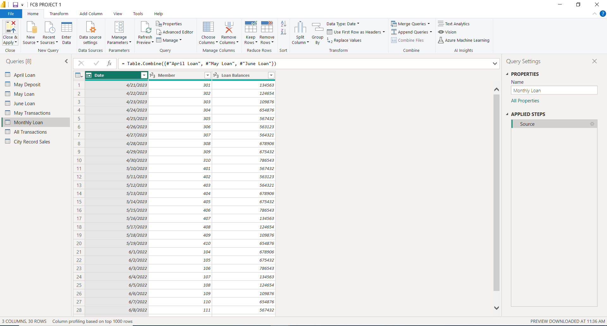

# FCB-Project---1
This repository is one of the projects I worked on at the Future Clan Bootcamp and in it, I worked on data cleaning, merging and appending with Power Query in Power BI.
***
**DATA CLEANING**  

Data cleaning is the process of identifying and correcting any incorrect, corrupted, incorrectly formatted, duplicate, or incomplete data within a dataset. When combining multiple data sources, there are many opportunities for data to be duplicated, mislabeled or formatted incorrectly which is why data cleaning is a very important step in data analysis.
The image below shows how I cleaned a dataset by ensuring the data was properly entered and the datatype was properly formatted.

**DATA MERGING**  

This is the process of combining two or more datasets into a single unified database as shown by the image below.

**APPENDING DATA**  

Data appending is the process of adding missing data or updating existing data in a database. An example of this is shown by the image below.

